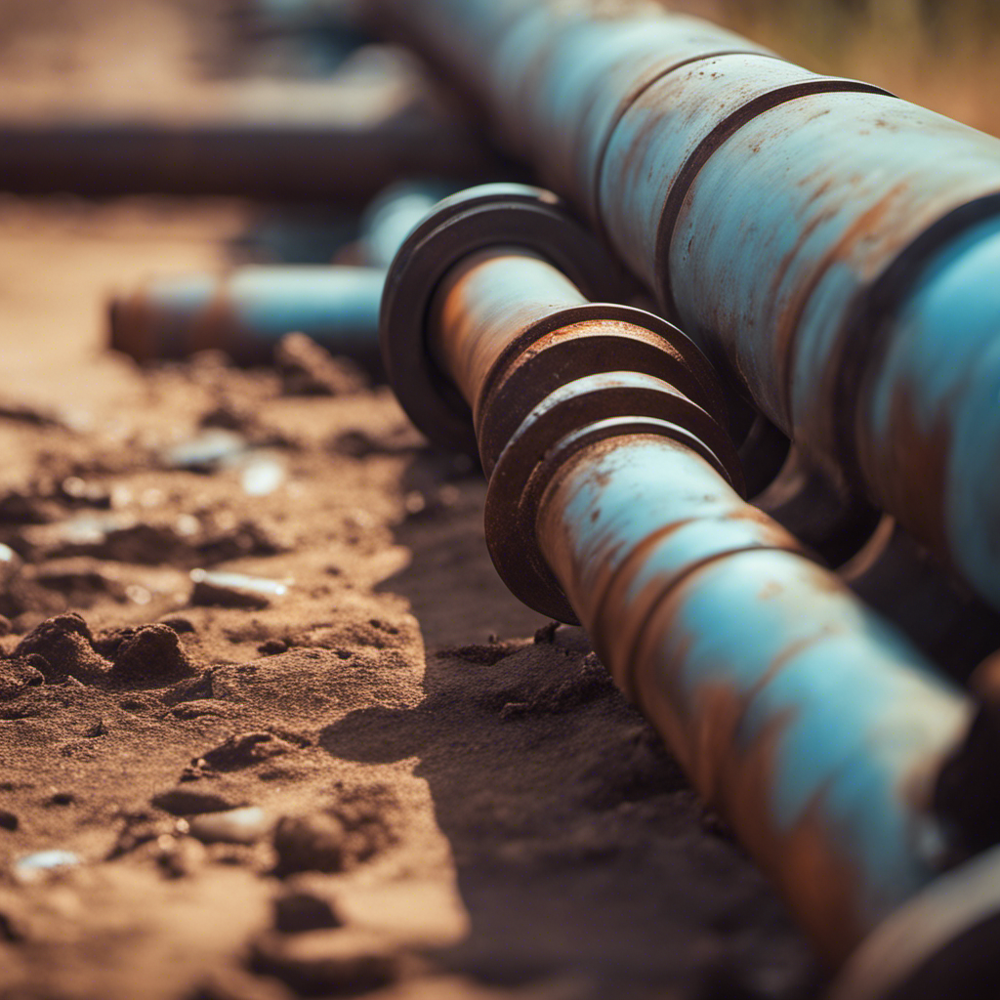

# Image generation via ApiGateway -> Lambda -> Bedrock -> S3


This pattern demonstrates how to generate images using a serverless workflow using Amazon Bedrock (Stable Diffusion XL) and save the images to S3. The pattern has a default prompt to generate images of an rusted oil pipeline as pictured below.

Note: this pattern includes a layer with a custom version of boto3. Using an outdated boto3 version will result in an ["unknown service error"](https://repost.aws/knowledge-center/lambda-python-runtime-errors)
Note: this patten also incldues a custom layer for Pillow

Important: this application uses various AWS services and there are costs associated with these services after the Free Tier usage - please see the [AWS Pricing page](https://aws.amazon.com/pricing/) for details. You are responsible for any AWS costs incurred. No warranty is implied in this example.

### Requirements

* [Create an AWS account](https://portal.aws.amazon.com/gp/aws/developer/registration/index.html) if you do not already have one and log in. The IAM user that you use must have sufficient permissions to make necessary AWS service calls and manage AWS resources.
* [AWS CLI](https://docs.aws.amazon.com/cli/latest/userguide/install-cliv2.html) installed and configured
* [Git Installed](https://git-scm.com/book/en/v2/Getting-Started-Installing-Git)
* [AWS Serverless Application Model](https://docs.aws.amazon.com/serverless-application-model/latest/developerguide/serverless-sam-cli-install.html) (AWS SAM) installed

## Amazon Bedrock setup instructions
You must request access to a model before you can use it. If you try to use the model (with the API or console) before you have requested access to it, you receive an error message. For more information, see [Model access](https://docs.aws.amazon.com/bedrock/latest/userguide/model-access.html).

1. In the AWS console, select the region from which you want to access Amazon Bedrock. At the time of writing, Amazon Bedrock is available in us-east-1 (N. Virginia) and us-west-2 (Oregon) regions.

    

1. Find **Amazon Bedrock** by searching in the AWS console.

    

1. Expand the side menu.

    

1. From the side menu, select **Model access**.

    

1. Select the **Edit** button.

    

6. Use the checkboxes to select the models you wish to enable. Review the applicable EULAs as needed. Click **Save changes** to activate the models in your account. For this pattern we only need Anthropic/Claude but feel free to experiment with others.

## Deployment Instructions

1. Create a new directory, navigate to that directory in a terminal and clone the GitHub repository:
    ``` 
    git clone https://github.com/aws-samples/serverless-patterns
    ```
1. Change directory to the pattern directory:
    ```
    cd serverless-patterns/apigw-lambda-bedrock-cdk-python
    ```
1. Create virtual environment for Python
    ```
    python3 -m venv .venv
    ```
    For a Windows platform, activate the virtualenv like this:
    ```
    .venv\Scripts\activate.bat
    ```
1. Install the Python required dependencies:
    ```
    pip install -r requirements.txt
    ```
1. Run the command below to bootstrap your account. CDK needs it to deploy
    ```
    cdk bootstrap
    ```
1. Review the CloudFormation template the cdk generates for you stack using the following AWS CDK CLI command:
    ```
    cdk synth
    ```
1. From the command line, use AWS CDK to deploy the AWS resources.
    ```
    cdk deploy
    ```
1. After deployment completes, take a look at the Outputs section. There will be an entry containing the URL of the API Gateway resource you just created. Copy that URL as you'll need it for your tests.

    The format of the URL will be something like `https://{id}.execute-api.{region}.amazonaws.com/prod`


## How it works

CDK will create an Api Gateway, along with a resource and a POST method. There's a AWS Lambda function that will be taking the prompt and invoking an Amazon Bedrock synchronously. 


## Testing

We'll be making requests to the *image_gen* endpoint with a desired prompt.

Follow the example below and replace `{your-api-url}` with your api url from step 8. 

    ```
    curl -X POST \
    {your-api-url}/text_gen \
    -H "Content-Type: application/json" \
    -d '{"prompt": "Rusted oil pipeline weathered, damaged, old"}'
    ```

## Review results

Go to Amazon S3, and navigate to the S3 bucket. It will have a name similar to 'apigwlambdabedrockstack-mybucket...'. In the directory `\tmp\` you should see `image-{num}.png`. 

Here is an example generated image:


## Cleanup
 
1. Run below script in the `apigw-lambda-bedrock-cdk-python` directory to delete AWS resources created by this sample stack.
    ```bash
    cdk destroy
    ```

## Extra Resources
* [Bedrock Api Reference](https://docs.aws.amazon.com/bedrock/latest/APIReference/welcome.html)

----
Copyright 2023 Amazon.com, Inc. or its affiliates. All Rights Reserved.

SPDX-License-Identifier: MIT-0