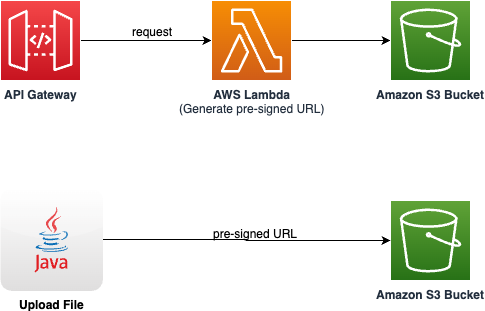

# Upload file upto 5GB to Amazon S3 bucket using presigned URL

This sample project deploys an Amazon API Gateway REST API with an AWS Lambda integration. The Lambda function, written in Java, generates a presigned URL with write access to an Amazon S3 Bucket. The provided test class uploads a file into the S3 bucket using the presigned URL.

Learn more about this pattern at Serverless Land Patterns: serverlessland.com/patterns/apigw-lambda-s3-sam-java

Important: this application uses various AWS services and there are costs associated with these services after the Free Tier usage - please see the [AWS Pricing page](https://aws.amazon.com/pricing/) for details. You are responsible for any AWS costs incurred. No warranty is implied in this example.

## Requirements

- [Create an AWS account](https://portal.aws.amazon.com/gp/aws/developer/registration/index.html) if you do not already have one and log in. The IAM user that you use must have sufficient permissions to make necessary AWS service calls and manage AWS resources.
- [AWS CLI](https://docs.aws.amazon.com/cli/latest/userguide/install-cliv2.html) installed and configured
- [Git Installed](https://git-scm.com/book/en/v2/Getting-Started-Installing-Git)
- [AWS Serverless Application Model](https://docs.aws.amazon.com/serverless-application-model/latest/developerguide/serverless-sam-cli-install.html) (AWS SAM) installed
- [Java 17 or above](https://docs.aws.amazon.com/corretto/latest/corretto-17-ug/downloads-list.html) installed
- [Maven 3.8.6 or above](https://maven.apache.org/download.cgi) installed


## Deployment Instructions

1. Create a new directory, navigate to that directory in a terminal and clone the GitHub repository:
   ```bash
   git clone https://github.com/aws-samples/serverless-patterns
   ```

2. Change directory to the pattern directory:
   ```bash
   cd serverless-patterns/apigw-lambda-s3-sam-java
   ```

3. From the command line, execute the below command to build the Java based AWS Lambda funtion using Maven. This will create `MyS3PreSignedURLGeneratorFunction.zip` file under the `target` folder.
   ```bash
   mvn clean package
   ```

4. From the command line, use AWS SAM to deploy the AWS resources for the pattern as specified in the template.yml file:
   ```bash
   sam deploy --guided
   ```
5. During the prompts:

   - Enter a stack name
   - Enter the desired AWS Region. 
   - Allow SAM CLI to create IAM roles with the required permissions.
   - MyS3PreSignedURLGeneratorFunction has no authentication. Is this okay? [y/N]: select `y`
   

   When asked "`MyS3PreSignedURLGeneratorFunction` has no authentication. Is this okay? [y/N]", answer explicitly with y for the purposes of this sample application. As a result, anyone will be able to call this example REST API without any form of authentication.

   For production applications, you should [enable authentication for the API Gateway](https://docs.aws.amazon.com/apigateway/latest/developerguide/apigateway-control-access-to-api.html) using one of several available options and [follow the API Gateway security best practices](https://docs.aws.amazon.com/apigateway/latest/developerguide/security-best-practices.html).
   
   - Keep default values to the rest of the parameters.

   Once you have run `sam deploy --guided` mode once and saved arguments to a configuration file (samconfig.toml), you can use `sam deploy` in future to use these defaults.

6. Note the outputs from the SAM deployment process. These contain the resource names and/or ARNs which are used for next step as well as testing.

## How it works

This SAM project uses allows user to upload a file up to 5 GB size using Amazon S3 bucket pre-sienged URL. Please refer to the architecture diagram below:



Here's a breakdown of the steps:

1. **Amazon API Gateway**: Receives the HTTP POST request containing the file name to be uploaded.

2. **AWS Lambda**: Triggered by the API Gateway, this function creates a pre-signed S3 bucket URL with PUT object permission for the provided key (file name).

3. **Amazon S3**: User uploads a file upto 5 GB size using pre-signed URL. 

## Testing

1. Run the following command from to run the test class to upload a file using Amazon S3 pre-signed URL:

   ```bash
   java -cp target/test-classes/ com.example.S3UploadIntegrationTest
   ```

2. During the prompts:

   - Enter the REST API URL to get the pre-signed URL: from the `sam deploy` output
   - Enter the file name on S3 (key): s3userguide.pdf
   - Enter the path to the local file: s3userguide.pdf

If everything goes fine you should get a confirmation message:
   ```bash
   File uploaded successfully!
   ```

3. Log into [Amazon S3 Console]() and open the `MyS3BucketName` bucket to validate the file got uploaded successfully. 

## Cleanup

1. Delete the content in the Amazon S3 bucket using the following command. Please *ensure* that the correct bucket name is provided to avoid accidental data loss:
   ```bash
   aws s3 rm s3://{MyS3BucketName} --recursive --region {your-region}

2. To delete the resources deployed to your AWS account via AWS SAM, run the following command:

   ```bash
   sam delete
   ```


---

Copyright 2024 Amazon.com, Inc. or its affiliates. All Rights Reserved.

SPDX-License-Identifier: MIT-0
