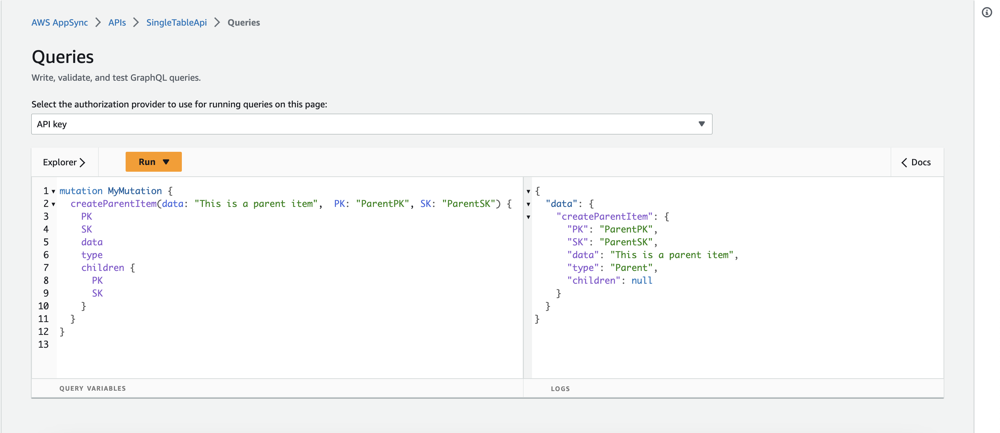

# AWS AppSync to Amazon DynamoDB - Single table design - JS Resolvers

This pattern creates an AppSync API with a schema and a javascript pipeline resolver to a DynamoDB table following the single table design model. The pattern uses the new [`GraphQLApi` resource for AWS SAM](https://docs.aws.amazon.com/serverless-application-model/latest/developerguide/sam-resource-graphqlapi.html).

Learn more about this pattern at Serverless Land Patterns: https://serverlessland.com/patterns/appsync-dynamodb-singletable-js-resolver

Important: this application uses various AWS services and there are costs associated with these services after the Free Tier usage - please see the [AWS Pricing page](https://aws.amazon.com/pricing/) for details. You are responsible for any AWS costs incurred. No warranty is implied in this example.

## Requirements

* [Create an AWS account](https://portal.aws.amazon.com/gp/aws/developer/registration/index.html) if you do not already have one and log in. The IAM user that you use must have sufficient permissions to make necessary AWS service calls and manage AWS resources.
* [AWS CLI](https://docs.aws.amazon.com/cli/latest/userguide/install-cliv2.html) installed and configured
* [Git Installed](https://git-scm.com/book/en/v2/Getting-Started-Installing-Git)
* [AWS Serverless Application Model](https://docs.aws.amazon.com/serverless-application-model/latest/developerguide/serverless-sam-cli-install.html) (AWS SAM) installed

## Deployment Instructions

1. Create a new directory, navigate to that directory in a terminal and clone the GitHub repository:
    ``` 
    git clone https://github.com/aws-samples/serverless-patterns
    ```
1. Change directory to the pattern directory:
    ```
    cd appsync-dynamodb-singletable-js-resolver
    ```
1. From the command line, use AWS SAM to deploy the AWS resources for the pattern as specified in the template.yml file:
    ```
    sam deploy --guided
    ```
1. During the prompts:
    * Enter a stack name
    * Enter the desired AWS Region
    * Allow SAM CLI to create IAM roles with the required permissions.

    Once you have run `sam deploy --guided` mode once and saved arguments to a configuration file (samconfig.toml), you can use `sam deploy` in future to use these defaults.

1. Note the outputs from the SAM deployment process. These contain the resource names and/or ARNs which are used for testing.

## How it works

This template creates an AppSync api that uses a DynamoDB javascript pipeline resolver. The `GetParentAndChildResolver` demonstrate using a custom resolver to format results from a single table design for AppSync.

## Testing

The easiest way to test the AppSync API is with the AppSync console at https://console.aws.amazon.com/appsync/home#/apis (change to your appropriate region)

Click on the API you created and visit the Queries tab

### Mutations

#### Parents
Paste the following command in the query editor to create a first parent:
```graphql
    mutation MyMutation {
      createParentItem(data: "This is a parent item", PK: "ParentPK", SK: "ParentSK") {
        PK
        SK
        data
        type
      }
    }
```
Paste the following command in the query editor to create a second parent:
```graphql
    mutation MyMutation {
      createParentItem(data: "This is another parent item", PK: "ParentPK2", SK: "ParentSK2") {
        PK
        SK
        data
        type
      }
    }
```



#### Children
Paste the following command in the query editor to create a first child:
```graphql
    mutation MyMutation {
      createChildItem(data: "This is child 1", parentPK: "ParentPK", parentSK: "ParentSK", PK: "ChildPK1", SK: "ChildSK1") {
        PK
        SK
        data
        parentPK
        parentSK
        type
      }
    }
```
Paste the following command in the query editor to create a second child:
```graphql
    mutation MyMutation {
      createChildItem(data: "This is child 2", parentPK: "ParentPK2", parentSK: "ParentSK2", PK: "ChildPK2", SK: "ChildSK2") {
        PK
        SK
        data
        parentPK
        parentSK
        type
      }
    }
```
Paste the following command in the query editor to create a third child:
```graphql
    mutation MyMutation {
      createChildItem(data: "This is child 3", parentPK: "ParentPK", parentSK: "ParentSK", PK: "ChildPK3", SK: "ChildSK3") {
        PK
        SK
        data
        parentPK
        parentSK
        type
      }
    }
```


### Queries
Now that we have all our records set, let's retrieve parent 1 and the related children.
```graphql
    query MyQuery {
      getParentWithChildren(PK: "ParentPK", SK: "ParentSK") {
        PK
        SK
        data
        type
        children {
          PK
          SK
          data
          parentPK
          parentSK
          type
        }
      }
    }
```
The result of this query should show parent 1 along with child 1 and 3.


## Cleanup
 
1. Delete the stack
    ```bash
    aws cloudformation delete-stack --stack-name STACK_NAME
    ```
1. Confirm the stack has been deleted
    ```bash
    aws cloudformation list-stacks --query "StackSummaries[?contains(StackName,'STACK_NAME')].StackStatus"
    ```
----
Copyright 2023 Amazon.com, Inc. or its affiliates. All Rights Reserved.

SPDX-License-Identifier: MIT-0