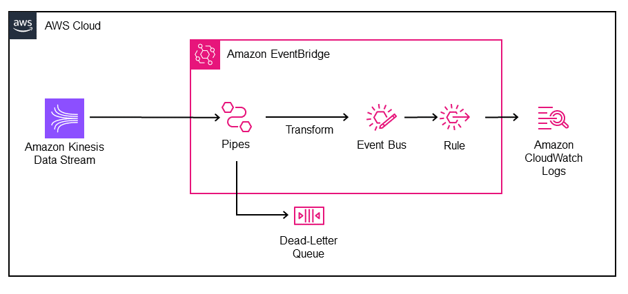

# Amazon Kinesis Data Stream to Amazon EventBridge Message Bus using Amazon EventBridge Pipes

This pattern showcases the use of Amazon EventBridge Pipes to forward events to an Amazon EventBridge custom Message Bus. Using this pattern, events placed on a queue on an Amazon Kinesis Data Stream are consumed by Amazon EventBridge Pipes which performs a basic transformation and places events on a Amazon EventBridge custom Message Bus. A rule defined on the Amazon EventBridge custom Message Bus writes events received to an Amazon CloudWatch Log Group.

Learn more about this pattern at Serverless Land Patterns: <https://serverlessland.com/patterns/eventbridge-pipes-kinesis-to-eventbridge-sam>

Important: this application uses various AWS services and there are costs associated with these services after the Free Tier usage - please see the [AWS Pricing page](https://aws.amazon.com/pricing/) for details. You are responsible for any AWS costs incurred. No warranty is implied in this example.

## Requirements

* [Create an AWS account](https://portal.aws.amazon.com/gp/aws/developer/registration/index.html) if you do not already have one and log in. The IAM user that you use must have sufficient permissions to make necessary AWS service calls and manage AWS resources.
* [AWS CLI](https://docs.aws.amazon.com/cli/latest/userguide/install-cliv2.html) installed and configured
* [Git Installed](https://git-scm.com/book/en/v2/Getting-Started-Installing-Git)
* [AWS Serverless Application Model](https://docs.aws.amazon.com/serverless-application-model/latest/developerguide/serverless-sam-cli-install.html) (AWS SAM) installed

## Deployment Instructions

1. Create a new directory, navigate to that directory in a terminal and clone the GitHub repository:

    ```bash
    git clone https://github.com/aws-samples/serverless-patterns
    ```

1. Change directory to the pattern directory:

    ```bash
    cd eventbridge-pipes-kinesis-to-eventbridge-sam
    ```

1. From the command line, use AWS SAM to deploy the AWS resources for the pattern as specified in the template.yml file:

    ```bash
    sam deploy --guided
    ```

1. During the prompts:
    * Enter a stack name
    * Enter the desired AWS Region
    * Optionally, adjust the default parameters (see `template.yaml` for descriptions of each)
    * Allow SAM CLI to create IAM roles with the required permissions.

    Once you have run `sam deploy --guided` mode once and saved arguments to a configuration file (samconfig.toml), you can use `sam deploy` in future to use these defaults.

1. Note the outputs from the SAM deployment process. These contain the resource names and/or ARNs which are used for testing.

## How it works



Amazon Kinesis Data Stream is configured as a source for an Amazon EventBridge Pipe. The pipe consumes events placed on the queue and sends these to an Amazon EventBridge custom message bus. Amazon EventBridge Pipe performs a simple transformation of the event payload adding some meta data about the Pipe producing the event during processing. An Amazon EventBridge rule then processes any events produced by the Pipe to a CloudWatch Log Group configured to receive the events. The CloudWatch Log target on the Amazon EventBridge could be replaced with another target to build event-driven services with native AWS integrations reacting to events produced on a Amazon Kinesis Data Stream.

## Testing

To test this pattern you need to open **CloudWatch Logs** with the name provided for the AWS SAM *Parameters* `CloudWatchLogGroup`, by default this Log Group will be `/aws/events/kinesis-to-eventbridge`.

Next, From the command line, use the AWS CLI to put a new record on the Amazon Kinesis Stream using the `aws kinesis put-record` command

Bash:

```bash
aws kinesis put-record --stream-name pipes-data-stream --data $(echo '{"Message":"Hello World"}'| base64) --partition-key $(uuidgen)
```

PowerShell:

```PowerShell
$TestEvent = [System.Convert]::ToBase64String([System.Text.Encoding]::UTF8.GetBytes("{`"Message\`":\`"Hello World`"}"))
aws kinesis put-record --stream-name pipes-data-stream --data $TestEvent --partition-key (New-Guid)
```

Switch back to **CloudWatch Logs** and confirm that the event has been written. You should have a payload similar to the following:

```json
{
    "version": "0",
    "id": "11111111-2222-3333-4444-7bd8348cd732",
    "detail-type": "StreamEventProduced",
    "source": "com.aws.pipes-data-stream",
    "account": "12345678912",
    "time": "2023-11-18T15:24:57Z",
    "region": "us-east-1",
    "resources": [],
    "detail": {
        "pipeArn": "arn:aws:pipes:us-east-1:12345678912:pipe/kinesis-to-eventbridge",
        "pipeIngestionTime": "2023-11-18T15:24:57.936Z",
        "originalEvent": {
            "eventSource": "aws:kinesis",
            "eventVersion": "1.0",
            "eventID": "shardId-000000000000:49646551841131506763358994072241739912472740984482955266",
            "eventName": "aws:kinesis:record",
            "invokeIdentityArn": "arn:aws:iam::12345678912:role/eventbridge-kinesis-PipeRole-5bO9vuvWkVQL",
            "awsRegion": "us-east-1",
            "eventSourceARN": "arn:aws:kinesis:us-east-1:12345678912:stream/pipes-data-stream",
            "kinesisSchemaVersion": "1.0",
            "partitionKey": "3b7547c6-7572-41ba-8385-0319fe680998",
            "sequenceNumber": "49646551841131506763358994072241739912472740984482955266",
            "data": "ZXlKTlpYTnpZV2RsSWpvaVNHVnNiRzhnVjI5eWJHUWlmUW89",
            "approximateArrivalTimestamp": 1700321084.47
        }
    }
}
```

## Cleanup

1. Delete the stack

    ```bash
    sam delete
    ```

1. Confirm the stack has been deleted

    ```bash
    aws cloudformation list-stacks --query "StackSummaries[?contains(StackName,'STACK_NAME')].StackStatus"
    ```

----
Copyright 2023 Amazon.com, Inc. or its affiliates. All Rights Reserved.

SPDX-License-Identifier: MIT-0
