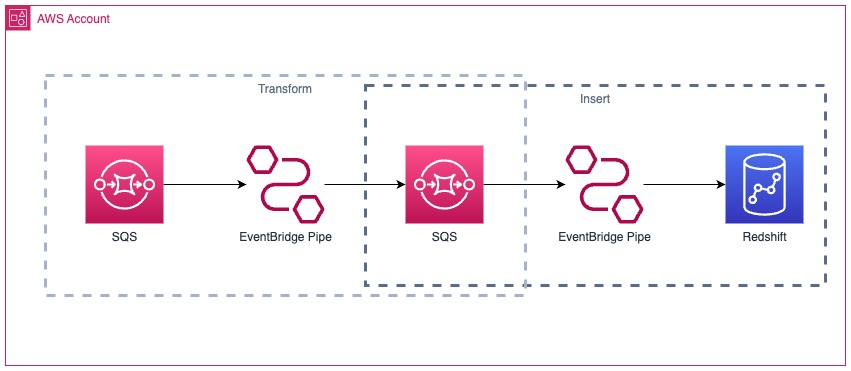

# Amazon SQS Integration With Amazon Redshift using Amazon EventBridge Pipes 

This pattern demonstrates how to send messages from Amazon SQS queue to Amazon Redshift cluster using Amazon EventBridge Pipes and utilizing Amazon Redshift data API queries as target. 

Learn more about this pattern at Serverless Land Patterns: https://serverlessland.com/eventbridge-pipes-sqs-to-redshift

Important: this application uses various AWS services and there are costs associated with these services after the Free Tier usage - please see the [AWS Pricing page](https://aws.amazon.com/pricing/) for details. You are responsible for any AWS costs incurred. No warranty is implied in this example.

## Requirements

* [Create an AWS account](https://portal.aws.amazon.com/gp/aws/developer/registration/index.html) if you do not already have one and log in. The IAM user that you use must have sufficient permissions to make necessary AWS service calls and manage AWS resources.
* [AWS CLI](https://docs.aws.amazon.com/cli/latest/userguide/install-cliv2.html) installed and configured
* [Git Installed](https://git-scm.com/book/en/v2/Getting-Started-Installing-Git)
* [AWS Cloud Development Kit](https://docs.aws.amazon.com/cdk/v2/guide/getting_started.html) installed
* [Python 3.x Installed](https://www.python.org/) Python 3.x installed with pip.

## Getting Started
The entire solution is built using AWS Cloud Development Kit (CDK) in Python. The instructions below shows how solution works, deployment instructions, testing steps and cleanup.

### How it works
The solution will create two Amazon SQS queues, Amazon Redshift Cluster, and an EventBridge Pipes to connect it all.
- EventBridge pipes internally create consumers for SQS queue and polls for new messages from source queue 
- EventBridge pipes transform the SQS message to create insert queries from data within message and then send the transformed messages to a target SQS queue. 
- EventBridge pipes then run Redshift data API queries to the insert data to Amazon Redshift cluster `pipestarget` in `private` database in `messages` table and add the SQS messages

For more informations: [Amazon EventBridge Pipes with SQS ](https://docs.aws.amazon.com/eventbridge/latest/userguide/eb-pipes-sqs.html) and  [Amazon Redshift Data API ](https://docs.aws.amazon.com/redshift/latest/mgmt/data-api-calling-event-bridge.html)

### Architecture


### Deployment Instructions

1. Create a new directory, navigate to that directory in a terminal and clone the GitHub repository:
    ``` 
    git clone https://github.com/aws-samples/serverless-patterns
    ```

2. Change directory to the pattern directory:
    ```
    cd eventbridge-pipes-sqs-to-redshift
    ```

3. Once the repository is cloned open terminal on project directory and create a virtualenv on MacOS and Linux:
    ```
    python3 -m venv .venv
    ```

4. After the init process completes and the virtualenv is created, you can use the following step to activate your virtualenv.
    ```
    source .venv/bin/activate
    ```

    In Windows platform, you would activate the virtualenv like this:
    ```
    .venv\Scripts\activate.bat
    ```

5. Once the virtualenv is activated, you can install the required dependencies.
    ```
    pip install -r requirements.txt
    ```

6. At this point you can now synthesize the CloudFormation template for this code.
    ```
    cdk synth
    ```

7. Once the synthesize is successful deploy this stack
    ```
    cdk deploy
    ```

## Testing Steps
For testing you will be using AWS CLI commands to send a message source SQS queue and Redshift cluster data API queries to read data from Redshift cluster.

1. Send a test message to source SQS queue, run the below CLI command and replace the Update `--queue-url` with source SQS queue url from CDK deployment output  
    ```
    aws sqs send-message --queue-url <Source SQS Queue URL:> --message-body "Message To Redshift via EventBridge Pipe."
    ```

    Output sample response:
    ```
    {
        "MD5OfMessageBody": "c905630d3f30e240e0f467960bf80dd5",
        "MessageId": "696ae5f3-5581-4283-9cc0-abd599f2f1f3"
    }
    ```

2. To to fetch data from Redshift cluster, run the blew Redshift cluster data API queries
    ```
    Id=`aws redshift-data execute-statement --sql "select message.body from messages" --database private --cluster-identifier pipestarget --db-user awsuser --query Id --output text` 
    sleep 5
    aws redshift-data get-statement-result --id $Id
    ```
    
    Output sample response:
    ```
    {
    "Records": [
        [
            {
                "stringValue": "\"Message To Redshift via EventBridge Pipe.\""
            }
        ]
    ],
    "ColumnMetadata": [
        {
            "isCaseSensitive": true,
            "isCurrency": false,
            "isSigned": false,
            "label": "body",
            "length": 0,
            "name": "body",
            "nullable": 1,
            "precision": 2147483647,
            "scale": 0,
            "schemaName": "",
            "tableName": "",
            "typeName": "super"
        }
    ],
    "TotalNumRows": 1
    }

    ```
    
## Cleanup 

1. To cleanup/delete resources created while deploying the solution, go to the root folder of the project repository and run 
    ```
    cdk destroy
    ```

You will then be prompted to confirm that you want to proceed with deleting all the stacks. This will begin the process for decommissioning the resources.

### Useful commands

 * `cdk ls`          list all stacks in the app
 * `cdk synth`       emits the synthesized CloudFormation template
 * `cdk deploy`      deploy this stack to your default AWS account/region
 * `cdk diff`        compare deployed stack with current state
 * `cdk docs`        open CDK documentation
----
Copyright 2024 Amazon.com, Inc. or its affiliates. All Rights Reserved.

SPDX-License-Identifier: MIT-0
