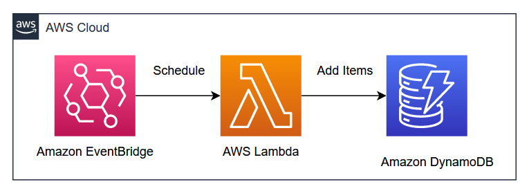

# Schedule AWS Lambda to add items to Amazon DynamoDB

This AWS CDK application demonstrates how to schedule AWS Lambda to add items to Amazon DynamoDB.

This pattern uses .NET as a programming language to create the entire AWS CDK stack. Consider a scenario where an application needs to get and display Associate's details on page load from external HR system. External HR system was deployed to on-premises so there was a delay to retrieve the associate details using API while loading the application and frequent API calls were made to the on-premises server. Also, in-memory cache was used to load the associate details in the application which made the solution stateful.

As part of application modernization, one of the goal is going cloud native and refactoring stateful application to be stateless. This pattern implements an automated solution to overcome this problem by scheduling a Lambda function on daily basis to add the most recent associate data in Amazon DynamoDB table to be used by the application and other downstream microservices. Amazon DynamoDB TTL (Time to Live) was enabled to purge the old data in Dynamo DB on daily basis.

Provisioning cloud applications can be a challenging process that requires you to perform manual actions, write custom scripts, maintain templates, or learn domain-specific languages. AWS CDK provisions your resources in a safe, repeatable manner through AWS CloudFormation. It also enables you to compose and share your own custom constructs that incorporate your organization's requirements, helping you start new projects faster.

## Architecture 


Learn more about this pattern at Serverless Land Patterns: https://serverlessland.com/patterns/eventbridge-schedule-lambda-to-dynamodb

**Important**: this application uses various AWS services and there are costs associated with these services after the Free Tier usage - please see the [AWS Pricing page](https://aws.amazon.com/pricing/) for details. You are responsible for any AWS costs incurred. No warranty is implied in this example.

## Requirements

* [Create an AWS account](https://portal.aws.amazon.com/gp/aws/developer/registration/index.html) if you do not already have one and log in. The IAM user that you use must have sufficient permissions to make necessary AWS service calls and manage AWS resources.
* [AWS CLI](https://docs.aws.amazon.com/cli/latest/userguide/install-cliv2.html) installed and configured
* [Git Installed](https://git-scm.com/book/en/v2/Getting-Started-Installing-Git)
* [.NET 6](https://dotnet.microsoft.com/en-us/download/dotnet/7.0) installed
* [AWS Cloud Development Kit](https://docs.aws.amazon.com/cdk/latest/guide/cli.html) (AWS CDK) installed

## Deployment Instructions

1. Clone the project to your local working directory.
    ```
    git clone https://github.com/aws-samples/serverless-patterns
    ```
2. Change the working directory.
    ```
    cd eventbridge-schedule-lambda-to-dynamodb/cdk
    ```
3. Bootstrap AWS Environment.
    ```
    cdk bootstrap
    ```
4. Deploy the stack to your default AWS account and region.
    ```
    cdk deploy
    ```

## Testing

1. After deployment, navigate to Amazon DynamoDB table in AWS Console and verify if items are created every minute as per the schedule.

## Cleanup

Run the given command to delete the resources that were created. It might take some time for the CloudFormation stack to get deleted.
```
cdk destroy
```
----
Copyright 2023 Amazon.com, Inc. or its affiliates. All Rights Reserved.

SPDX-License-Identifier: MIT-0