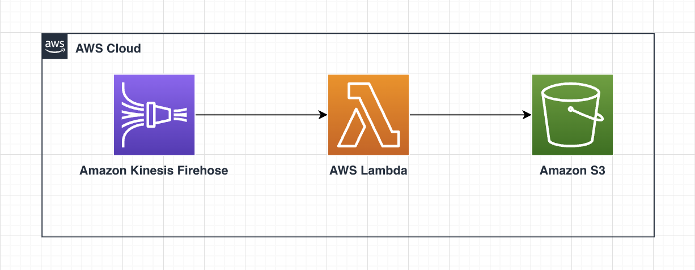
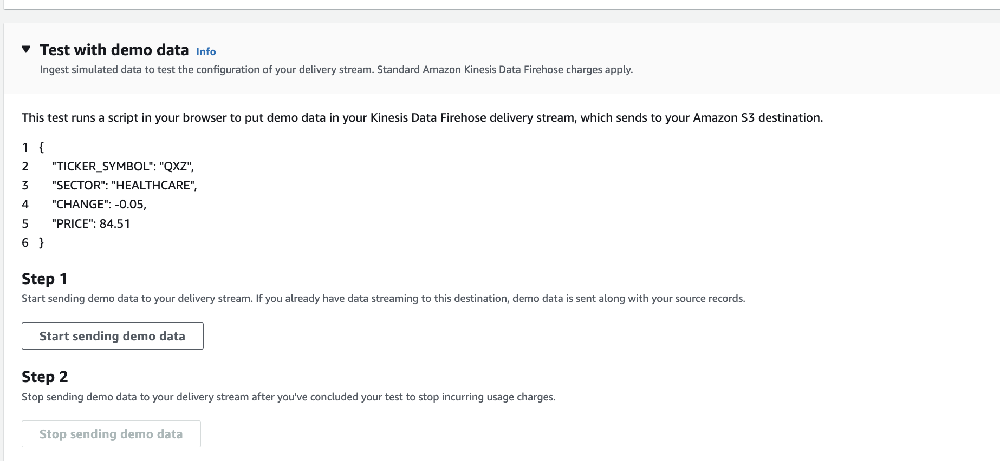
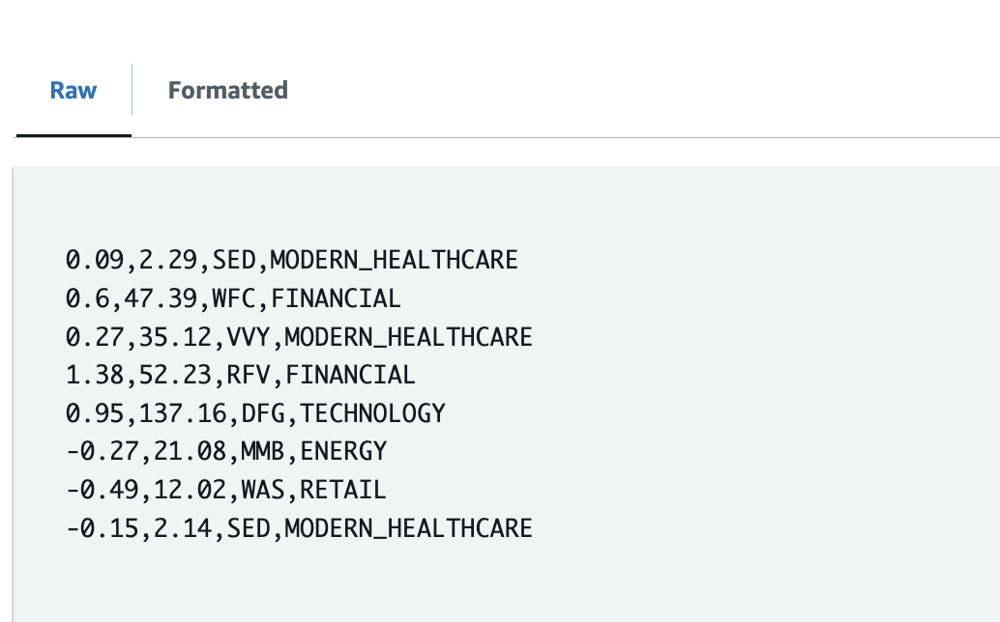

# Kinesis Firehose Data Transformation with Lambda (Terraform)
# Transform incoming source data and deliver the transformed data to destinations.

The purpose of this pattern is to deploy the infrastructure necessary to enable Kinesis Data Firehose data transformation.

Kinesis Data Firehose can invoke a Lambda function to transform incoming source data and deliver the transformed data to destinations. In this architecture, Kinesis Data Firehose then invokes the specified Lambda function asynchronously with each buffered batch using the AWS Lambda synchronous invocation mode. 

The transformed data is sent from Lambda to Kinesis Data Firehose. Kinesis Data Firehose then sends it to the destination S3 bucket when the specified destination buffering size or buffering interval is reached, whichever happens first.

In this project, the data transformation lambda will modify the value of 'HEALTHCARE' to 'MODERN_HEALTHCARE' for demonstration purposes.

Learn more about this pattern at [Serverless Land Patterns](https://serverlessland.com/patterns/kinesis-firehose-data-transformation-lambda-terraform).

Important: this application uses various AWS services and there are costs associated with these services after the Free Tier usage - please see the [AWS Pricing page](https://aws.amazon.com/pricing/) for details. You are responsible for any AWS costs incurred. No warranty is implied in this example.

## Requirements

* [Create an AWS account](https://portal.aws.amazon.com/gp/aws/developer/registration/index.html) if you do not already have one and log in. The IAM user that you use must have sufficient permissions to make necessary AWS service calls and manage AWS resources.
* [AWS CLI](https://docs.aws.amazon.com/cli/latest/userguide/install-cliv2.html) installed and configured
* [Git Installed](https://git-scm.com/book/en/v2/Getting-Started-Installing-Git)
* [Terraform](https://learn.hashicorp.com/tutorials/terraform/install-cli?in=terraform/aws-get-started) installed

## Deployment Instructions

1. Clone the project to your local working directory

   ```sh
   git clone https://github.com/aws-samples/serverless-patterns/ 
   ```

2. Change the working directory to this pattern's directory

   ```sh
   cd serverless-patterns/kinesis-firehose-data-transformation-lambda-terraform
   ```

3. From the command line, initialize terraform to  to downloads and installs the providers defined in the configuration:
    ```
    terraform init
    ```

4. From the command line, apply the configuration in the main.tf file:
    ```
    terraform apply
    ```

5. During the prompts:
   - Enter yes

## How it works



This pattern deploys a Kinesis Firehose Delivery Stream, a transformation Lambda function, a destination S3 bucket, and all of the additional required infrastructure services.

Kinesis Data Firehose can invoke a Lambda function to transform incoming source data and deliver the transformed data to destinations. In this architecture, Kinesis Data Firehose then invokes the specified Lambda function asynchronously with each buffered batch using the AWS Lambda synchronous invocation mode. 

The transformed data is sent from Lambda to Kinesis Data Firehose. Kinesis Data Firehose then sends it to the destination S3 bucket when the specified destination buffering size or buffering interval is reached, whichever happens first.

Note: The default region is `us-east-1`, it can also be changed using the variable `region`.

**Note:** Variables can be supplied in different options, check the [Terraform documentation](https://developer.hashicorp.com/terraform/language/values/variables) for more details.

## Testing

To test this project, follow the below steps:

1. Generating Data: 
    Go to this link  * [Testing Your Delivery Stream Using Sample Data](https://docs.aws.amazon.com/firehose/latest/dev/test-drive-firehose.html?icmpid=docs_console_unmapped) and follow the steps mentioned in this section 'Test Using Amazon S3 as the Destination'.

2. Wait for few minutes and then stop the data generation process.
   

3. Once the Kinesis Buffer Interval threshold is reached, go to S3 in the AWS console and select the bucket that you created. You should now see sample data (GZIP) under a prefix.

4. Select the S3 object and then choose 'Action > Query with S3 Select'. Specify the Input settings as the following:
    ```
        Format              : JSON
        JSON Content Type   : Lines
        Compression         : GZIP
    ```

    Leave rest of the settings as default and then select 'Run SQL Query'.

5. Under 'Query Results', you should now be able to view the results. Specifically, you should notice the values for 'HEALTHCARE' should now be modified to 'MODERN_HEALTHCARE'. This demonstrates that the data got transformed through the data transformation lambda successfully.   
     

## Cleanup

1. Change directory to the pattern directory:
    ```sh
    cd serverless-patterns/kinesis-firehose-data-transformation-lambda-terraform
    ```

2. Delete all created resources
    ```sh
    terraform destroy
    ```

3. During the prompts:
    * Enter yes

4. Confirm all created resources has been deleted
    ```sh
    terraform show
    ```

## Reference
- [AWS Lambda - the Basics](https://docs.aws.amazon.com/lambda/latest/dg/getting-started.html)
- [Lambda Function Handler](https://docs.aws.amazon.com/lambda/latest/dg/python-handler.html)
- [Amazon Kinesis Firehose](https://aws.amazon.com/kinesis/data-firehose/)

----
Copyright 2023 Amazon.com, Inc. or its affiliates. All Rights Reserved.

SPDX-License-Identifier: MIT-0