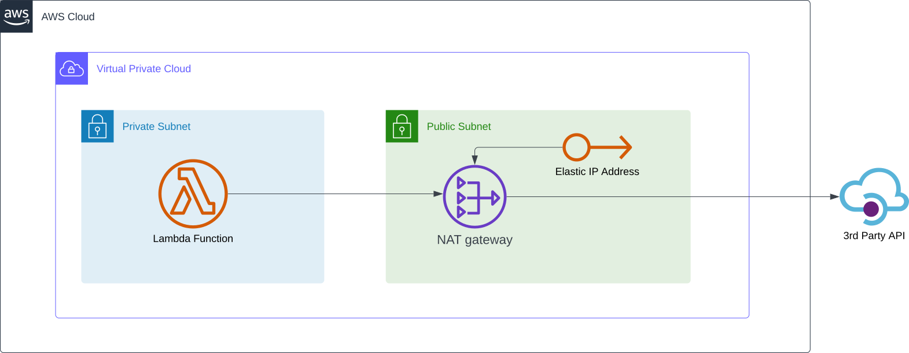
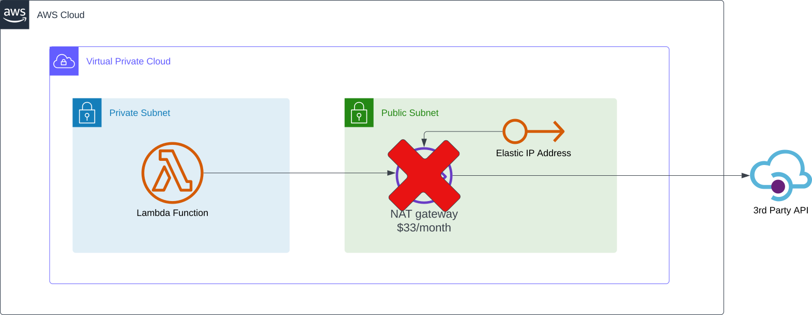

# AWS Lambda Elastic IP without NAT Gateway

This project contains a sample AWS Cloud Development Kit (AWS CDK) template for deploying a Lambda function with a public elastic IP that has internet access without the need to provision a NAT gateway.

## Architecture 

## Production Architecture 

## Non-prod cost effective Architecture



Learn more about this pattern at Serverless Land Patterns: https://serverlessland.com/patterns/lambda-elastic-ip-no-nat-gateway-cdk.

Important: This application uses various AWS services and there are costs associated with these services after the Free Tier usage - please see the [AWS Pricing page](https://aws.amazon.com/pricing/) for details. You are responsible for any AWS costs incurred. No warranty is implied in this example.

## Requirements

- [Create an AWS account](https://portal.aws.amazon.com/gp/aws/developer/registration/index.html) if you do not already have one and log in. The IAM user that you use must have sufficient permissions to make necessary AWS service calls and manage AWS resources.
- [AWS CLI](https://docs.aws.amazon.com/cli/latest/userguide/install-cliv2.html) installed and configured
- [Git Installed](https://git-scm.com/book/en/v2/Getting-Started-Installing-Git)
- [AWS CDK](https://docs.aws.amazon.com/cdk/latest/guide/cli.html) installed and configured

## Deployment Instructions

1. Create a new directory, navigate to that directory in a terminal, and clone the GitHub repository:
   ```bash
   git clone https://github.com/aws-samples/serverless-patterns
   ```
2. Change the directory to the pattern directory:
   ```bash
   cd serverless-patterns/lambda-elastic-ip-no-nat-gateway-cdk/cdk
   ```
3. Install dependencies for both the infrastructure project and the typescript project:
   ```bash
   npm install
   cd src
   npm install
   cd ..
   ```

4. From the command line, configure AWS CDK:
   ```bash
   cdk bootstrap ACCOUNT-NUMBER/REGION # e.g.
   cdk bootstrap 9999999999/us-east-1
   cdk bootstrap --profile test 9999999999/us-east-1
   ```
5. From the command line, use AWS CDK to deploy the AWS resources for the pattern as specified in the `lib/cdk-stack.ts` file:
   ```bash
   cdk deploy
   ```

## Use Case
This solution will help you, if your use case tick the following bullet points: 
- You are trying to connect to a 3rd party API
- 3rd party API requires whitelisting a static IP of its clients
- You want to use Lambda functions

#### Current Industry Standard Solution
Place your Lambda in *private* subnet. Place a NAT Solution (NAT Gateway/NAT Instance) in a *public* subnet and attach an AWS Elastic IP to the NAT Solution.

This solution is actually great and offers HA (with NAT Gateways) and scalable. Exactly what you need for production environments

Solution is explained in details [here](https://docs.aws.amazon.com/prescriptive-guidance/latest/patterns/generate-a-static-outbound-ip-address-using-a-lambda-function-amazon-vpc-and-a-serverless-architecture.html)
###### *However...*

NAT Gateways come at a cost (**~$33/month per gateway**). To make NAT Gateway Highly Available & Scalable you need to provision 1 NAT Gateway per subnet.
So, if you have 3 subnets the cost will be:

**3 * $33 = ~$100/month**
Now this is nearly an unavoidable expense for your production environments, as scalability & HA are requirements.

However, if you have 3 non-prod environments (DEV, QA, STAGE...) the cost of these environments will be **3 accounts * $100 = ~$300/month**. High Availability is not probably a requirement for these environments.

So, This solution will help you save on NAT costs when scalability & HA are not required.

## How it works

This pattern kick things off by provisioning an Elastic IP in your account. 
As you may know, AWS manages the provisioning of ENIs for each Lambda provisioned within an AWS VPC. Using CDK code we won't have access to that ENI. However, once that ENI is provisioned it can be accessed. So the pattern will create a Custom Resource that taps into that ENI and make a CLI call (using the SDK) to attach it to the Elastic IP.

Now that the lambda has an elastic IP associated to its network interface, you can copy that Elastic IP and whitelist it with your 3rd party vendors so the lambda can connect to it.

#### Main Benefit:
Saving on NAT Gateway costs **$33/month per subnet per environment-account** when the solution does not need to be very scalable or highly available

##### **NOTE:** This pattern is best suited for non-production environments since it is not multi-AZ nor highly scalable.

The following resources will be provisioned:

- A Lambda function to test the pattern
- An Elastic IP to associate with the Lambda function
- A custom resource with Lambda function to associate the Elastic IP with the test lambda's ENI


##### **NOTE:** This pattern is best suited for non-production environments since it is not multi-AZ nor highly scalable.

### Limitations To Be Aware Of

- Elastic IPs: 5 per Region [VPC Quotes](https://docs.aws.amazon.com/vpc/latest/userguide/amazon-vpc-limits.html)
- Network interfaces:  5,000 per Region
- HENIs (Hyperplane ENIs) soft limit of 250 per VPC and the hard limit is 350 HENIs per VPC [link](https://aws.plainenglish.io/dealing-with-you-have-exceeded-the-maximum-limit-for-hyperplane-enis-for-your-account-223147e7ab64#b6c5)
    - Hyperplane ENI is a special type of ENI used by AWS Lambda to cut off on the start up time of ENI provisioning and provide the capability of sharing the underlying network hardware for all Lambdas in *subnet+securityGroup* combination (for more [info](https://aws.amazon.com/blogs/compute/announcing-improved-vpc-networking-for-aws-lambda-functions/))
    
- There is a limit of 65K on connections for a single Hyperplane ENI. So, if group of Lambdas in the same Subnet+SecurityGroup combination create more than 65K connections at the same time, AWS will provision a new ENI for the connection number 65001 [Lambda ENI](https://docs.aws.amazon.com/lambda/latest/dg/foundation-networking.html#foundation-nw-eni-create)(Thanks to Yan Cui for pointing that out in the [comment on this video](https://www.youtube.com/watch?v=yV1TGDYR3qU&t=92s&ab_channel=YanCui))  

### Pricing Notes
You are still charged for data transfer expenses in and out of the ENI (~$0.09/GB in each direction) [data-transfer pricing](https://aws.amazon.com/ec2/pricing/on-demand/#Data_Transfer)


## Testing

To test this pattern, use the AWS Console or the AWS CLI.

### AWS Console Part

1. Open the AWS Lambda Console
2. Navigate to `vin-api-lambda`
3. Test the lambda with any payload
4. The Lambda function shouldn't time out and a random vin should be returned and logged.

## Cleanup

1. Delete the stack
   ```bash
   cdk destroy
   ```

## Resources

1. [Lambda in a VPC](https://docs.aws.amazon.com/prescriptive-guidance/latest/patterns/generate-a-static-outbound-ip-address-using-a-lambda-function-amazon-vpc-and-a-serverless-architecture.html)

---

Copyright 2023 Amazon.com, Inc. or its affiliates. All Rights Reserved.

SPDX-License-Identifier: MIT-0
